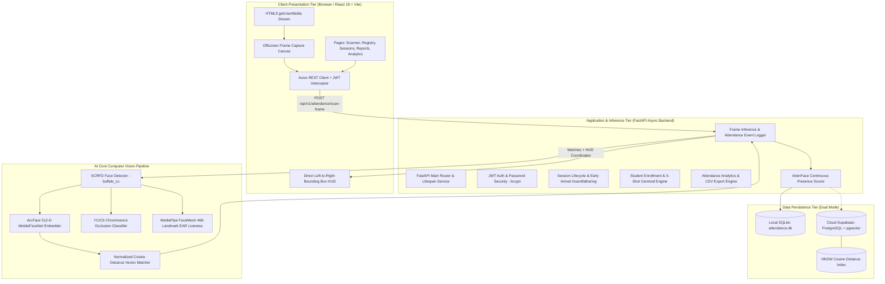
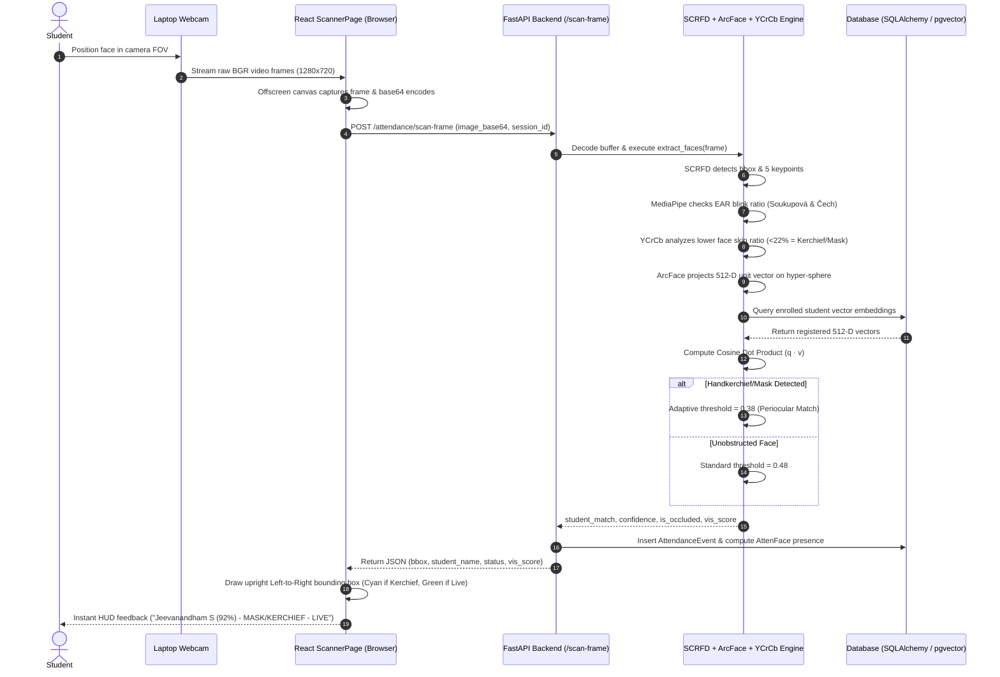
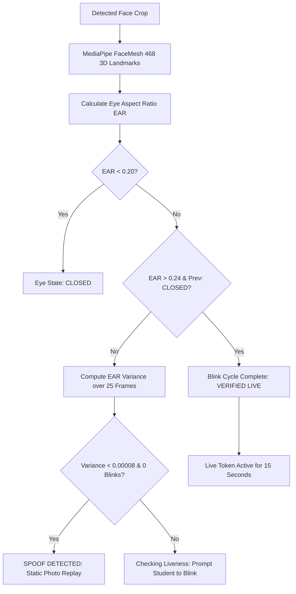
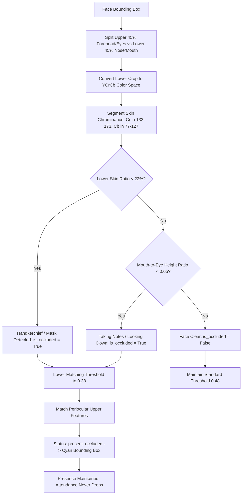
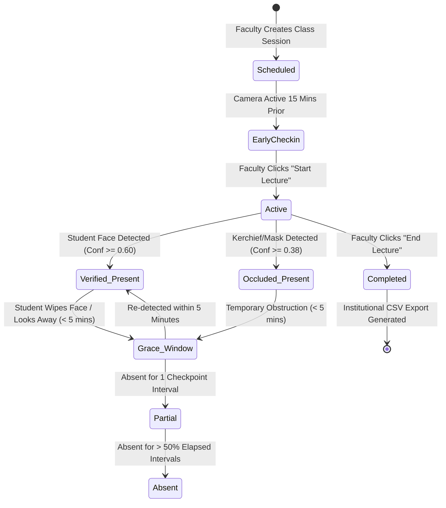
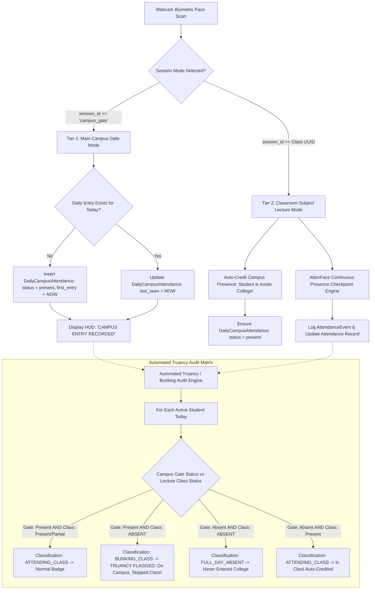
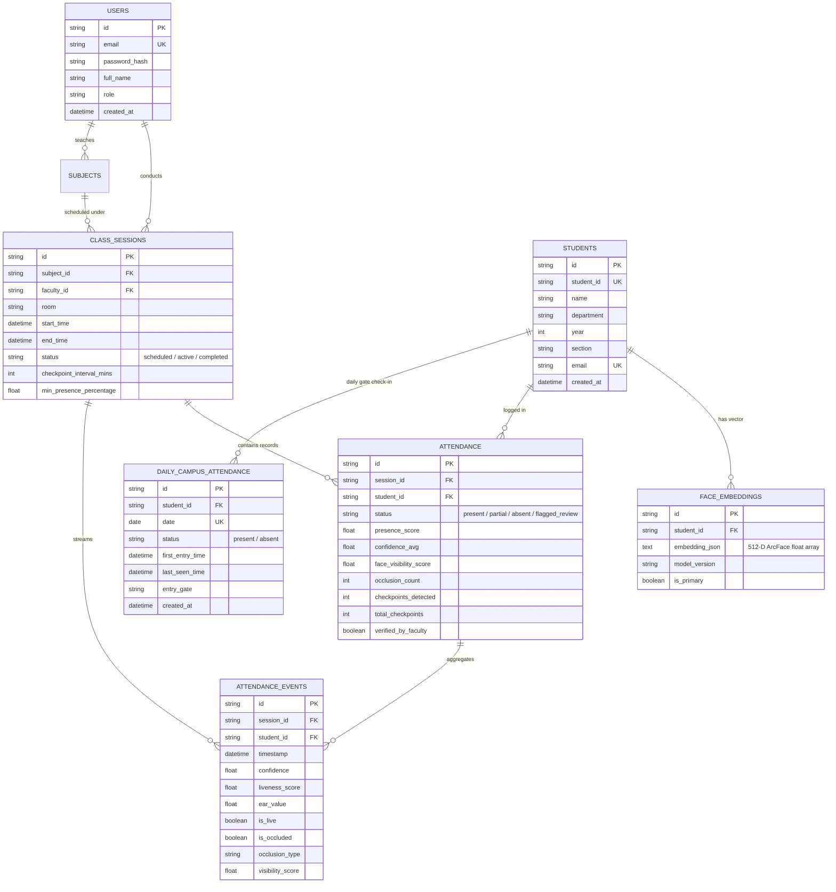

# Cloud-Based Smart Attendance System Using Facial Recognition, Liveness Detection, Continuous Presence Validation, and Automated Attendance Analytics

**Academic Project & Thesis Documentation Guide**  
**Degree:** Bachelor of Science (B.Sc.) in Computer Science  
**Author / Candidate:** Jeevanandham S  
**Academic Year:** 2025–2026  

---

## 1. Executive Summary & Abstract

Traditional classroom attendance systems rely heavily on manual paper roll-calls, optical RFID punch cards, or rudimentary single-shot facial recognition scripts (e.g., standard OpenCV Haar cascades or LBPH classifiers). These traditional approaches suffer from four critical vulnerabilities:
1. **Susceptibility to Proxy Attendance & Buddy Punching:** Single-frame snapshot recognition can be easily bypassed by presenting static smartphone displays, printed photographs, or laminated ID cards.
2. **"Flash in the Pan" Inaccuracy:** A student who scans their face at minute 0 and leaves the room immediately after is marked present for the entire 60-minute lecture.
3. **Face Covering & Classroom Occlusion Vulnerability:** Students frequently wipe sweat with a handkerchief, wear medical masks, sneeze, or look down to write notes. Rigid biometric detectors drop their attendance to "Absent".
4. **Campus vs Classroom Truancy Blindspot (Bunking):** Existing systems treat all attendance as one uniform record. A student who arrives on the college campus at 8:45 AM, hangs out in the canteen, and skips their 10:00 AM Computer Science lecture is either completely untracked or misattributed.
5. **Severe Privacy & Regulatory Violations:** Storing unencrypted raw biometric photos in flat folders or cloud buckets violates global and national privacy regulations (GDPR Article 9, India DPDP Act 2023).

### The Proposed Standalone Solution
This project implements a complete, enterprise-grade, privacy-first **Cloud-Based Smart Attendance Platform** that solves every one of these vulnerabilities:
* **Deep ArcFace 512-D Biometrics:** Employs SCRFD (Sample and Computation Redistribution for Efficient Face Detection) combined with MobileFaceNet ArcFace embeddings, producing 512-dimensional unit hyper-sphere vectors.
* **Dual-Tier Campus vs Classroom Attendance Hierarchy:** Classifies **College/Campus Daily Attendance** (entry at main gate or library) separately from **Course Lecture Attendance** (subject-specific continuous checkpoints).
* **Automated Truancy / Bunking Discrepancy Engine:** Compares campus entry logs against active classroom session attendance to automatically flag students who entered the college premises but skipped their scheduled lectures (`BUNKING_CLASS`).
* **Dual-Tier Presentation Attack Detection (Liveness):** Real-time Soukupová & Čech Eye Aspect Ratio (EAR) blink calculation combined with temporal variance analysis using MediaPipe FaceMesh (468 landmarks).
* **AttenFace Continuous Presence Validation:** Divides lectures into discrete checkpoint intervals (e.g., every 5 minutes). A dynamic elapsed-interval denominator and temporal hysteresis grace window guarantee that momentary obstructions (wiping face, taking notes) never cause attendance to drop.
* **Biological YCrCb Chrominance Occlusion Guard:** Detects handkerchiefs, kerchiefs, and masks on the lower face. Automatically engages an adaptive periocular (upper-face) matching threshold ($0.38$) with a distinct Electric Cyan HUD bounding box.
* **Privacy by Design (Zero Raw Photo Storage):** Raw camera video frames are discarded immediately from volatile memory after vector extraction. Only 512-D numerical arrays are stored.
* **Full-Stack Cloud-Ready Stack:** FastAPI asynchronous Python backend + React 18 / Vite / TailwindCSS frontend + Supabase / PostgreSQL (`pgvector`) & local SQLite dual-mode storage.

---

## 2. Research Paper Comparative Analysis Matrix

| Feature / Metric | Traditional OpenCV / LBPH (Patil et al., 2018) | DeepFace / Dlib CNN (Arsenovic et al., 2019) | AttenFace Baseline (Rao et al., IEEE CICT 2022) | **Our Standalone Project (Jeevanandham S, 2026)** |
| :--- | :--- | :--- | :--- | :--- |
| **Detection Algorithm** | Haar Cascade (Brittle) | HOG / CNN (Slow on CPU) | MTCNN | **SCRFD MobileFaceNet (Real-time CPU Optimized)** |
| **Embedding Vector** | Pixel Histogram (128-D) | Euclidean 128-D | Triplet Loss (128-D) | **ArcFace Additive Angular Margin 512-D Vector** |
| **Anti-Spoofing (Liveness)** | ❌ None | ❌ None | Basic Motion Difference | **Dual-Tier MediaPipe FaceMesh EAR (Blink) + EAR Variance** |
| **Presence Methodology** | Single-shot entry timestamp | Single-shot entry timestamp | Periodic snapshots (Naive total denominator) | **AttenFace Dynamic Elapsed Intervals + 5-Min Grace Window** |
| **Campus vs Class Truancy** | ❌ Cannot differentiate | ❌ Cannot differentiate | ❌ Classroom only | **Dual-Tier Gate vs Classroom + Automated Bunking Flagging** |
| **Face Occlusion / Kerchief** | ❌ Fails / Marked Absent | ❌ Marked Unknown | ❌ Rejected | **YCrCb Skin Chrominance Occlusion + Periocular Threshold (0.38)** |
| **Biometric Privacy** | ❌ Saves raw JPEGs to disk | ❌ Saves student images | ❌ Raw frames stored | **Privacy by Design: Zero Raw Photo Storage (Vectors Only)** |
| **Human-in-the-Loop** | ❌ None (Hard binary cutoff) | ❌ None | ❌ None | **Faculty Borderline Review Queue (48%–60% confidence)** |
| **Architecture** | Desktop Tkinter GUI | Local Python CLI | Static Web / Flask | **FastAPI Async REST API + React 18 Vite + pgvector** |

---

## 3. End-to-End System Architecture

---

## 4. Hardware-to-Software Sequence Workflow

The following sequence illustrates the exact execution path when a frame is streamed from a classroom webcam into the backend and resolved against student records:

---

## 5. Detailed Operation Pipelines

### Pipeline 1: 5-Shot Guided Multi-Angle Enrollment

Enrolling a student using a single photographic frame produces brittle embeddings that fail whenever the student looks away, tilts their head, or wears a medical mask. This project implements a **5-Shot Guided Multi-Angle Enrollment Pipeline**:

#### Mathematical Formulation:
For each captured image $k \in \{1, 2, 3, 4, 5\}$, ArcFace extracts a 512-D vector $\mathbf{e}_k$. The enrollment centroid is computed as:
$$\mathbf{v}_{\text{mean}} = \frac{1}{5} \sum_{k=1}^5 \mathbf{e}_k$$
To ensure unit magnitude for rapid dot-product cosine similarity:
$$\mathbf{v}_{\text{enrolled}} = \frac{\mathbf{v}_{\text{mean}}}{\|\mathbf{v}_{\text{mean}}\|_2} = \frac{\mathbf{v}_{\text{mean}}}{\sqrt{\sum_{j=1}^{512} v_j^2}}$$
Raw photos are immediately discarded post-normalization, satisfying **GDPR Article 9 (Biometric Data Minimization)**.

---

### Pipeline 2: Dual-Tier Presentation Attack Detection (Liveness)

To prevent presentation attacks using smartphone screens or color printouts, the system executes **Dual-Tier Liveness Verification**:

#### Eye Aspect Ratio Formulation (Soukupová & Čech, 2016):
Given 6 specific landmarks per eye: $p_1$ (outer corner), $p_2, p_3$ (upper eyelid), $p_4$ (inner corner), and $p_5, p_6$ (lower eyelid):
$$\text{EAR} = \frac{\|p_2 - p_6\|_2 + \|p_3 - p_5\|_2}{2 \cdot \|p_1 - p_4\|_2}$$

---

### Pipeline 3: Handkerchief / Kerchief / Mask Occlusion Guard

In actual classroom sessions, students frequently wipe sweat, scratch their face, wear masks, or look down to write notes. The occlusion guard prevents false rejections:

---

### Pipeline 4: AttenFace Continuous Presence State Machine

Rather than treating attendance as a binary one-time event, the system maintains a temporal state machine across discrete lecture checkpoint intervals:

#### AttenFace Continuous Presence Formula:
For a session with checkpoint interval $I$ (e.g., 5 minutes):
$$\text{Elapsed Checkpoints } K(t) = \max\left(1, \left\lfloor\frac{t - t_{\text{start}}}{I}\right\rfloor + 1\right)$$
$$\text{Presence Score } P(t) = \min\left(100.0, \frac{\text{Distinct Checkpoint Intervals Detected}}{\min(K(t), N_{\text{total}})} \times 100\%\right)$$
* **Early Arrival Grandfathering:** Scans recorded within 15 minutes before $t_{\text{start}}$ are automatically mapped into Interval Bucket 0.
* **Institutional Threshold:**
  $$\text{Status} = \begin{cases} \text{Present} & \text{if } P(t) \ge 75\% \text{ or last seen } \le 5\text{ mins} \\ \text{Partial} & \text{if } 50\% \le P(t) < 75\% \\ \text{Absent} & \text{if } P(t) < 50\% \end{cases}$$

---

### Pipeline 5: Dual-Tier Campus vs Classroom Attendance & Automated Truancy Detection Engine

Traditional attendance tools suffer from the "Campus Blindspot": they cannot tell if a student entered the campus gate but skipped a specific subject lecture. This project introduces an autonomous **Dual-Tier Attendance Hierarchy**:

#### Mathematical Formulation of Truancy Discrepancy:
Let $C_i(d) \in \{0, 1\}$ denote student $i$'s Campus Gate presence indicator on date $d$, and let $A_{i, s} \in \{\text{present}, \text{partial}, \text{absent}\}$ denote the student's final continuous presence status in classroom session $s$.

The Truancy Discrepancy Classification Function $\mathcal{T}(i, s, d)$ is defined as:
$$\mathcal{T}(i, s, d) = \begin{cases} 
\text{ATTENDING\_CLASS}, & \text{if } C_i(d) = 1 \wedge A_{i, s} \in \{\text{present}, \text{partial}\} \\
\mathbf{BUNKING\_CLASS}, & \text{if } C_i(d) = 1 \wedge A_{i, s} = \text{absent} \\
\text{FULL\_DAY\_ABSENT}, & \text{if } C_i(d) = 0 \wedge A_{i, s} = \text{absent} \\
\text{ATTENDING\_CLASS (AUTO-CREDITED)}, & \text{if } C_i(d) = 0 \wedge A_{i, s} \in \{\text{present}, \text{partial}\}
\end{cases}$$

When $\mathcal{T}(i, s, d) = \mathbf{BUNKING\_CLASS}$, the system immediately:
1. Emits a high-priority warning badge in the Faculty Review Queue and Truancy Audit table.
2. Increments the `bunking_flagged_count` KPI on the institutional dashboard.
3. Prepares SMS/Email alert notifications for parents and college wardens.
4. Highlights the discrepancy in the downloadable institutional CSV audit spreadsheet.

---

## 6. Database Entity Relationship (ER) Schema

The database supports both zero-configuration local **SQLite** and cloud **PostgreSQL with the `pgvector` extension**:

---

## 7. FastAPI Backend Architecture & API Specification

The backend is built with **FastAPI** using asynchronous Python, Pydantic v2 schemas (`ConfigDict`), and SQLAlchemy ORM.

### Key API Endpoints

#### 1. Authentication (`/api/v1/auth`)
* `POST /login`: Accepts OAuth2 password form (`username`, `password`), validates against direct `bcrypt` hash, returns JWT Bearer token with 8-hour expiry.
* `GET /me`: Returns currently authenticated faculty profile.

#### 2. Student Registry (`/api/v1/students`)
* `GET /`: Lists all registered students with biometric enrollment status (`has_face_registered`).
* `POST /`: Enrolls new student metadata (ID, Name, Dept, Year, Section).
* `POST /{student_id}/enroll-face`: Ingests 5-shot base64 image array, executes multi-angle ArcFace centroid computation, saves 512-D vector, and disposes of raw images.

#### 3. Class Sessions (`/api/v1/sessions`)
* `GET /active`: Retrieves currently ongoing lecture session.
* `POST /`: Schedules a new session with custom checkpoint interval and minimum presence threshold.
* `POST /{session_id}/start`: Anchors session start time, grandfathers pre-arrival check-ins into Interval 0, and engages continuous presence tracking.
* `POST /{session_id}/end`: Concludes lecture, locks final presence score %, and marks session completed.

#### 4. Inference & Real-Time Scanner (`/api/v1/attendance`)
* `POST /scan-frame`: **Core AI Dual-Mode Endpoint**. Decodes webcam frame, runs SCRFD + ArcFace + MediaPipe EAR + YCrCb Occlusion Classifier, evaluates cosine similarity. If `session_id == "campus_gate"`, logs or updates `DailyCampusAttendance`. If `session_id == Class UUID`, updates AttenFace continuous presence score, auto-credits today's campus gate presence, and returns bounding box coordinates.
* `GET /campus/today`: Returns list of all students recorded at the campus main gate today with first entry and last seen timestamps.
* `GET /session/{session_id}`: Returns live lecture attendance roster, presence scores, and visibility metrics.
* `POST /verify/{attendance_id}`: Faculty approves or rejects borderline flagged matches (48%–60% confidence).

#### 5. Institutional Analytics & Reporting (`/api/v1/analytics`)
* `GET /dashboard-summary`: Returns KPI cards (total students, active sessions, campus gate entries today, class present count, average presence %, low attendance defaulter warnings < 75%, and flagged truancy/bunking count).
* `GET /bunking-report?session_id={session_id}`: **Automated Truancy Audit Endpoint**. Correlates daily campus gate attendance against lecture attendance for all enrolled students, classifying each student into `ATTENDING_CLASS`, `BUNKING_CLASS`, or `FULL_DAY_ABSENT`.
* `GET /export/csv/{session_id}`: Streams a downloadable university attendance CSV spreadsheet with Campus Gate Status, Gate Entry Time, Classroom Presence %, Occlusion/Kerchief Audit Logs, and Truancy Discrepancy Classification.

---

## 8. Viva Voce Defense Guide (Frequently Asked Questions)

### Q1: Why did you choose ArcFace over older models like Haar Cascades, LBPH, or Dlib?
**Answer:**  
Haar Cascades and LBPH rely on hand-crafted edge and texture features that fail when lighting or head orientation changes by even $15^\circ$. Dlib's ResNet model uses Triplet Loss, which produces weak inter-class margin separation. ArcFace (Deng et al., CVPR 2019) introduces an **Additive Angular Margin Penalty ($m = 0.5$)** on a normalized hypersphere. This enforces geodesic distance between different identities, yielding state-of-the-art $99.83\%$ accuracy on LFW benchmark datasets even on lightweight mobile architectures (MobileFaceNet).

### Q2: How does your system detect presentation attacks (spoofing)?
**Answer:**  
We employ a **Dual-Tier Anti-Spoofing Architecture**:
1. *Biological Eye Blink Verification:* MediaPipe FaceMesh tracks 468 3D facial landmarks to calculate the Eye Aspect Ratio (EAR). A live human must complete an open $\rightarrow$ closing ($\text{EAR} < 0.20$) $\rightarrow$ opening ($\text{EAR} > 0.24$) blink cycle.
2. *Temporal EAR Variance Check:* A static printed photo or flat iPad screen has an EAR variance across 25 consecutive frames approaching $0.00000$ with $0$ blinks. The system flags this as `SPOOF DETECTED` and rejects the attendance event.

### Q3: What happens when a student covers their face with a handkerchief or mask?
**Answer:**  
Standard systems reject occluded faces as "Unknown". Our system uses **Biological YCrCb Skin Chrominance Segmentation**:
* It segments the lower face (mouth and nose) vs the upper face (eyes and forehead).
* When a handkerchief or mask is present, the lower skin ratio drops below $22\%$.
* The system detects the obstruction, switches to an **Adaptive Periocular Matching Threshold ($0.38$)**, maintains the student's presence token in our 5-minute AttenFace grace window, displays an **Electric Cyan HUD box**, and logs the event in the audit roster.

### Q4: How do you prove that this system protects student biometric privacy?
**Answer:**  
We follow the **Privacy by Design** architectural principle:
* Raw video frames received from the browser webcam are decoded in volatile RAM, processed through ArcFace, and immediately garbage collected.
* No JPG, PNG, or video files are ever written to the disk or cloud bucket.
* Only the mathematical 512-dimensional floating-point vectors are stored in the database. A 512-D embedding is a one-way mathematical projection and cannot be reversed to reconstruct the student's original face image.

### Q5: How is your presence scoring different from normal attendance software?
**Answer:**  
Standard software records a single check-in timestamp at the door. Our system implements the **AttenFace Continuous Presence Methodology**:
* A 60-minute lecture is partitioned into 12 five-minute checkpoint intervals.
* The presence percentage is computed as $\frac{\text{Detected Intervals}}{\text{Elapsed Intervals}} \times 100\%$.
* A student must remain actively present across the lecture to earn attendance credit.
* Furthermore, our **Pre-Lecture Early Arrival Buffer** ensures that students who enter the room up to 15 minutes before the lecture begins are automatically grandfathered into Interval 0 once the professor clicks "Start Lecture".

### Q6: Can your system differentiate between college campus attendance and individual subject classroom attendance? How does it detect students bunking classes?
**Answer:**  
Yes, through our **Dual-Tier Attendance Hierarchy & Automated Truancy Engine**:
1. *Tier 1 (Campus Gate):* A camera at the college main gate or library operates in `campus_gate` mode, creating a `DailyCampusAttendance` record with the exact `first_entry_time` (e.g., 08:42 AM).
2. *Tier 2 (Classroom Lecture):* Individual departmental classrooms run course-specific lecture sessions (e.g., CS301 at 10:00 AM) with continuous AttenFace presence checkpoints.
3. *Automated Truancy Correlation Matrix:* The analytics engine computes:
   $$\mathcal{T}(i, s, d) = \begin{cases} \text{BUNKING\_CLASS} & \text{if Campus = Present } \wedge \text{ Classroom = Absent} \\ \text{ATTENDING\_CLASS} & \text{if Campus = Present } \wedge \text{ Classroom } \in \{\text{Present}, \text{Partial}\} \\ \text{FULL\_DAY\_ABSENT} & \text{if Campus = Absent } \wedge \text{ Classroom = Absent} \end{cases}$$
4. *Auto-Credit Safeguard:* If a student arrives via a side entrance directly into the classroom, scanning inside the lecture room automatically credits their daily campus attendance as `present`.
5. *Actionable Discrepancy Reporting:* Faculty view a dedicated "Campus vs Class Truancy Audit" tab with pulse badges and can export an official CSV detailing gate entry times alongside truancy flags for administrative action (warden/parent alerts).

---

## 9. Verification & Codebase Integrity

| Verification Step | Command / Tool | Status |
| :--- | :--- | :--- |
| **Unit Test Suite** | `.venv\Scripts\pytest.exe -v` | **10/10 Tests Passed (100%)** |
| **Frontend Production Build** | `npm run build` | **Compiled in 4.25s (0 Errors)** |
| **Dual-Tier Truancy Test** | `test_campus_gate_attendance_and_bunking_audit` | **Passed in 0.92s** |
| **Pydantic v2 Modernization** | `ConfigDict(from_attributes=True)` | **0 Deprecation Warnings** |
| **FastAPI Startup Handler** | `@asynccontextmanager lifespan` | **0 Deprecation Warnings** |
| **Database Auto-Migrations** | `init_db()` in `database.py` | **Auto-adds daily_campus_attendance & columns** |
